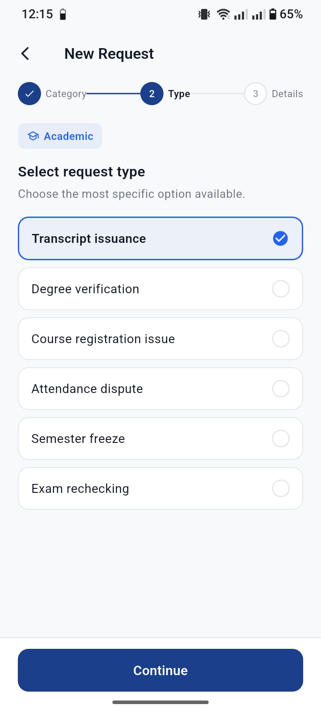
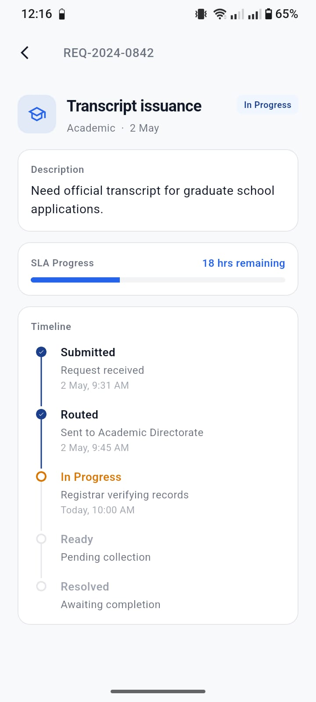

# NUST One - Student Support Services Center (S3C)


##  Overview
Since my team participated in the UI/UX design track so we built a flutter app and added the essential screens so that the design, UI and UX can be visualized. We named it **NUST One**.

**NUST One** is a centralized mobile application designed for the **Student Support Services Center (S3C) Design Competition 2026**. This initiative, developed under Rector NUST (Academics) in collaboration with the LMS Team, aims to bridge the gap and remove friction between university administrative offices and students by digitalizing essential campus services.

Traditionally, processes like issuing a transcript require students to physically visit offices, endure long wait times, and suffer from a lack of transparency regarding their application's status. **NUST One** solves this by providing a seamless, digital workflow to request, manage, and track services in real time.

---

##  Key Features (Based on implementation)
*   **Digital Service Requests:** Easily apply for services such as Transcript Issuance, Certificates, etc.
*   **Live Tracking:** Track the exact stage and status of your application without needing to visit the office.
*   **Push Notifications:** Get instantly notified when the status of an ongoing request changes.
*   **Document Uploads & QR Scanning:** Built-in scanner and image pickers to quickly upload required documents or verify identities directly from the app.
*   **Offline Support:** Caches data locally using `sqflite` so students can view their history without an active internet connection.

---

##  Screenshots

> *(Replace the image paths below with actual project screenshots once ready)*

| Home Dashboard | Service Request | Tracking Progress |
| :---: | :---: | :---: |
|  |  |  |

---

## 🛠 Tech Stack & Libraries
*   **Framework:** [Flutter](https://flutter.dev/)
*   **Language:** Dart
*   **Architecture & Best Practices:** Feature-based Domain-Driven folder structure.
*   **Local Storage & DB:** `sqflite`, `shared_preferences`, `flutter_secure_storage`

---

##  Getting Started

To run this project locally on your machine, follow these steps:

### Prerequisites
- Install [Flutter SDK](https://docs.flutter.dev/get-started/install) 
- Set up an Android/iOS emulator or connect a physical device.

### Installation
1. Clone the repository:
   ```bash
   git clone https://github.com/your-username/nust_one.git
   ```
2. Navigate to the project directory:
   ```bash
   cd nust_one
   ```
3. Install dependencies:
   ```bash
   flutter pub get
   ```
4. Run the app:
   ```bash
   flutter run
   ```
